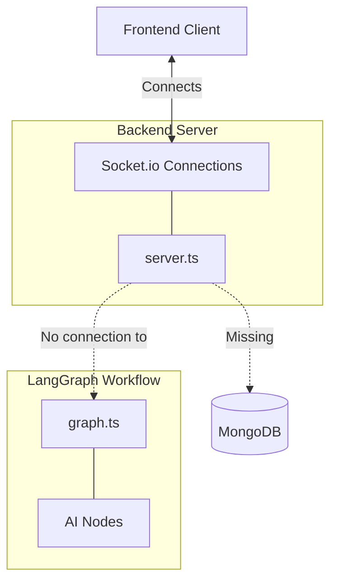

# Backend Architecture: Before vs. After

Here is the visual representation of how the architecture evolved after the backend orchestrator implementation.

## Before: Monolithic & Incomplete
The previous state was a single `server.ts` file with no database connection, no authentication, and no way to actually trigger the LangGraph AI workflow.



---

## After: Orchestrated & Modular
The new state introduces a dedicated router, secure authentication middleware, database schemas, and a clean interface for triggering the AI state machine.

```mermaid
flowchart TD
    Client[Frontend Client]

    subgraph Backend [Node.js / Express Server]
        ServerTS[server.ts]
        
        subgraph API [src/api/]
            Routes[routes.ts]
            Auth[auth.ts / JWT Middleware]
        end
        
        subgraph Sockets [src/sockets/]
            Events[socketEvents.ts]
        end
    end

    subgraph Database [src/database/]
        Models[models.ts]
        DB[(MongoDB)]
    end

    subgraph AI [src/graph/ (LangGraph)]
        Graph[graph.invoke]
        State[state.ts]
        Nodes[Vision, Safety, etc.]
    end

    %% Client Interactions
    Client -->|1. POST /api/auth/login| Routes
    Client -->|2. POST /api/analyze| Routes
    Client <-->|3. Listens for events| Events

    %% Server Internal Routing
    ServerTS --> Routes
    ServerTS --> Events
    
    %% Auth Flow
    Routes <-->|Validates| Auth
    
    %% API to Database
    Routes -->|Saves pending prescription| Models
    Models <--> DB

    %% API to AI Workflow
    Routes -->|Triggers async workflow| Graph
    Graph <--> State
    State <--> Nodes

    %% AI Workflow returning data
    Graph -->|Updates processed prescription| Models
    
    %% AI to Sockets
    Nodes -.->|emitStatus progress logs| Events
```

### Key Differences:
1. **Separation of Concerns**: `server.ts` is now purely an entry point. Routing is handled in `api/routes.ts` and real-time logic in `sockets/socketEvents.ts`.
2. **The Missing Link**: `routes.ts` now actively bridges the gap between a user uploading an image (`POST /analyze`) and the LangGraph execution (`graph.invoke`).
3. **Persistence**: We added Mongoose `models.ts` to persistently save users and their generated schedules to MongoDB.
